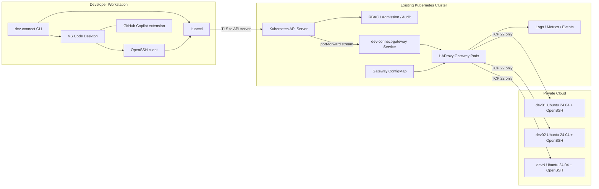
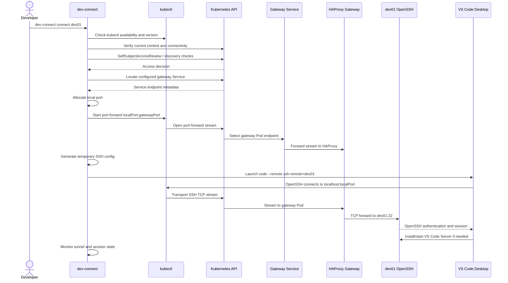
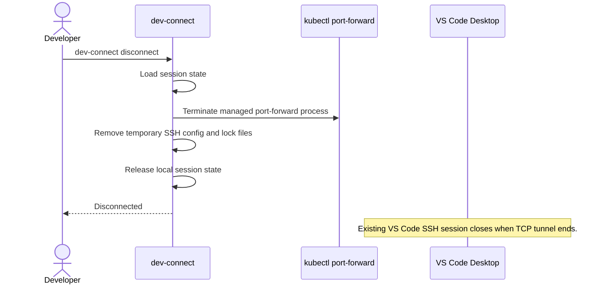
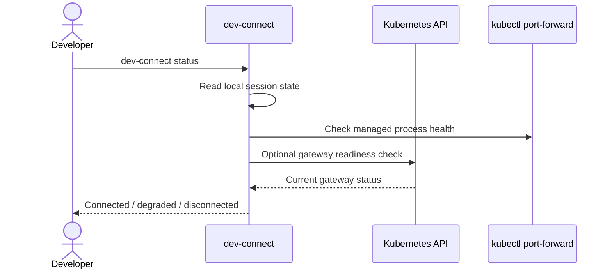
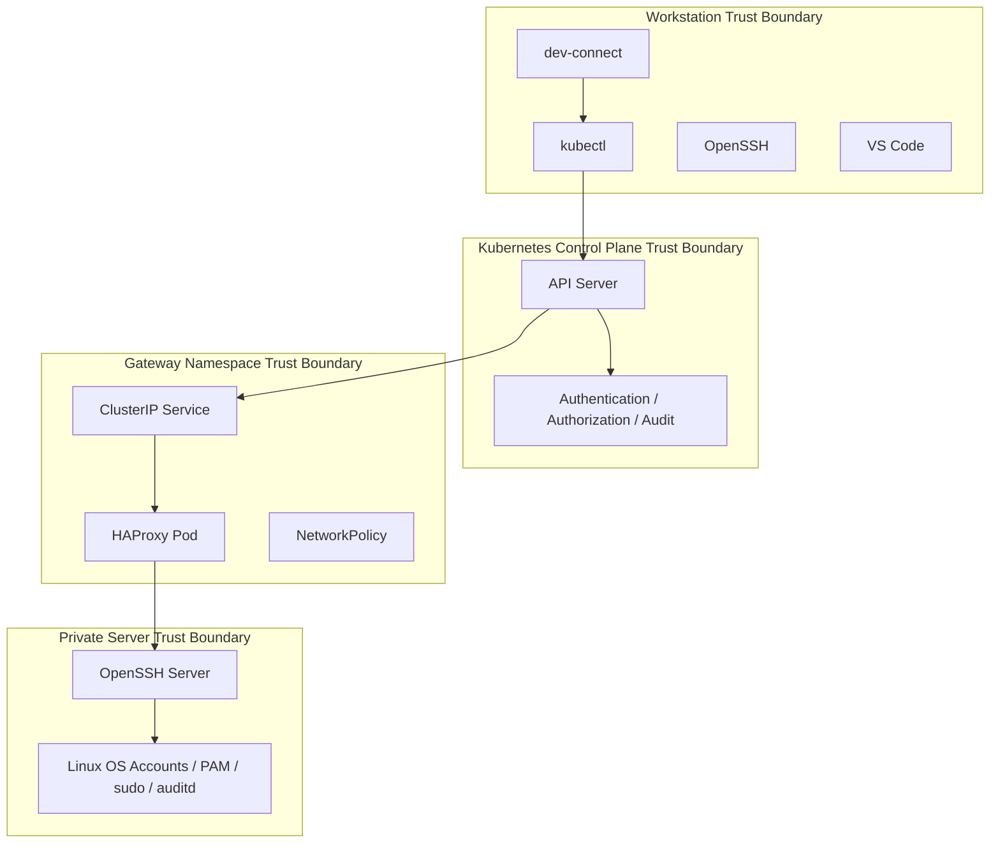

# dev-connect Architecture

Status: Approved

## 1. Purpose

`dev-connect` enables developers to use Microsoft Visual Studio Code Desktop, including GitHub Copilot and locally installed extensions, while connecting over SSH to Linux development servers located in a private cloud.

The private cloud is reachable only through an existing Kubernetes cluster. There is no VPN, no bastion host, and no public endpoint for the development servers. SSH traffic is transported through the Kubernetes API by using `kubectl port-forward` to a Kubernetes Service that fronts a TCP gateway.

The initial gateway implementation uses HAProxy and performs TCP forwarding only. SSH authentication, user authorization on the development server, VS Code Server installation, and shell access remain the responsibility of the target Linux server and standard OpenSSH.

## 2. Goals

- Support VS Code Desktop Remote SSH workflows without browser-based VS Code.
- Keep GitHub Copilot execution local on the developer workstation.
- Avoid public IPs, VPNs, and bastion hosts.
- Transport end-user SSH sessions through the Kubernetes API.
- Keep credentials, SSH keys, and user databases out of Kubernetes.
- Provide a production-ready foundation for multiple development servers, HA, observability, dynamic configuration, and multi-cluster operation.
- Follow Specification Driven Development and Test Driven Development in later phases.

## 3. Non-Goals

- The gateway does not terminate SSH.
- The gateway does not authenticate SSH users.
- The gateway does not store SSH keys, passwords, certificates, or user records.
- The gateway does not run development workloads inside Kubernetes.
- The initial release does not provide workspace scheduling, session recording, or dynamic service discovery. The architecture leaves room for future identity-provider integrations through the existing Rancher authentication model.

## 4. Overall Architecture

The system has three planes:

- Client plane: developer workstation, `dev-connect` CLI, `kubectl`, OpenSSH client, and VS Code Desktop.
- Kubernetes gateway plane: Kubernetes API server, RBAC, Service, HAProxy gateway Pods, NetworkPolicies, and observability integrations.
- Private development plane: Linux development servers running OpenSSH, reachable from gateway Pods on the private network.

## 5. Components

### 5.1 dev-connect CLI

The CLI is the developer entry point. In later phases it will be implemented in Go and support Windows, Linux, and macOS.

Responsibilities:

- Parse commands such as `connect`, `disconnect`, `status`, and `list`.
- Read YAML configuration for contexts, clusters, gateways, and server aliases.
- Detect `kubectl` and validate version compatibility.
- Verify Kubernetes connectivity and authorization before opening a session by invoking the locally installed `kubectl` binary.
- Allocate a free local TCP port.
- Start and supervise `kubectl port-forward`.
- Generate temporary SSH configuration pointing the selected alias to `127.0.0.1:<localPort>`.
- Launch VS Code Desktop with Remote SSH.
- Monitor tunnel health and reconnect when safe.
- Clean temporary files and processes after disconnect.

### 5.2 kubectl

`kubectl` is the only Kubernetes communication helper used by the first release. `dev-connect` shall never establish direct network connections to Rancher or the Kubernetes API. Kubernetes communication is delegated to the locally installed `kubectl` binary, which authenticates to the Kubernetes API using the developer's existing kubeconfig, enterprise identity flow, and enterprise proxy configuration.

Responsibilities:

- Execute all Kubernetes discovery, preflight, authorization checks, and port-forward operations requested by `dev-connect`.
- Execute `kubectl port-forward service/dev-connect-gateway <localPort>:<gatewayPort>`.
- Use Kubernetes API streaming protocols to carry TCP payloads.
- Rely on Kubernetes RBAC for authorization.
- Use the user's existing kubeconfig and enterprise proxy configuration by default.

Proxy behavior:

- `dev-connect` may support optional user-specific proxy configuration.
- Proxy overrides shall be applied only to `kubectl` processes started by `dev-connect`.
- Proxy overrides shall not modify the user's global operating system proxy settings, corporate proxy configuration, kubeconfig, or shell profile.

### 5.3 Kubernetes API Server

The API server is the required control and transport entry point into the private cloud.

Responsibilities:

- Authenticate the developer through existing Kubernetes authentication.
- Authorize `get/list/watch` as required for discovery and `create` on `pods/portforward` or equivalent service port-forward behavior.
- Audit port-forward requests.
- Transport the port-forward stream to the selected gateway Pod.

### 5.4 HAProxy Gateway

The gateway runs as Kubernetes Pods and initially uses HAProxy.

Responsibilities:

- Listen on internal Service ports.
- Forward raw TCP connections to configured Linux development servers.
- Preserve SSH end-to-end semantics without inspecting credentials.
- Emit connection logs and Prometheus-compatible metrics.
- Implement one HAProxy TCP listener on port 22 with one backend target per gateway Deployment for the first release.
- Defer multi-target routing to a later phase using separate gateway Deployments per target or dynamic gateway generation.
- Keep the server inventory model compatible with a future CRD/operator control plane.

Explicit constraints:

- No SSH termination.
- No SSH key storage.
- No credential validation.
- No user database.
- No public endpoint.

### 5.5 Kubernetes Service

The Service provides a stable in-cluster target for `kubectl port-forward`.

Initial design:

- `ClusterIP` Service.
- One gateway listener on TCP port 22.
- One backend development server target per gateway Deployment.
- No `LoadBalancer`, `NodePort`, or Ingress.

### 5.6 Development Servers

Development servers are Linux hosts outside Kubernetes, initially Ubuntu 24.04 LTS with OpenSSH.

Responsibilities:

- Perform SSH authentication and account authorization.
- Enforce user-level controls, shell access, filesystem permissions, sudo policy, and audit policy.
- Accept VS Code Remote SSH server installation according to standard VS Code behavior.

## 6. Communication Flows

### 6.1 Connect Flow

### 6.2 Disconnect Flow

### 6.3 Status Flow

## 7. Security Model

### 7.1 Trust Boundaries

### 7.2 Authentication

Kubernetes authentication:

- Reuses existing kubeconfig and cluster identity provider.
- Authentication and authorization for Kubernetes shall follow the existing Rancher authentication model.
- The solution must not introduce a separate identity store.
- Access permissions shall be granted through Rancher-managed Kubernetes RBAC and existing enterprise identity providers where configured.
- Local Kubernetes users are not part of the dev-connect access model.
- `dev-connect` shall not connect directly to Rancher or the Kubernetes API.
- All Kubernetes authentication, discovery, authorization checks, and port-forward operations shall be delegated to the locally installed `kubectl` binary.
- The CLI never asks for or stores Kubernetes credentials.
- Token refresh remains delegated to existing Kubernetes authentication plugins.

SSH authentication:

- Performed only by the target Linux development server.
- Uses standard OpenSSH methods such as public key, certificates, PAM-backed authentication, or enterprise SSH controls.
- The gateway does not inspect or validate SSH credentials.

VS Code authentication:

- VS Code Remote SSH uses the local OpenSSH client and local user configuration.
- GitHub Copilot remains local and follows the user's local VS Code authentication state.

### 7.3 Authorization

Kubernetes authorization:

- Developers receive least-privilege access to discover the gateway and create port-forward sessions only in the gateway namespace.
- RBAC shall be assigned through Rancher-managed Kubernetes RBAC.
- Recommended enterprise/Rancher groups are `dev-connect-users`, `dev-connect-admins`, and `platform-admins`.
- `dev-connect-users` shall receive only the permissions required to discover the gateway and create port-forward sessions.
- `dev-connect-admins` shall receive operational permissions for gateway configuration within the dev-connect namespace.
- `platform-admins` shall retain cluster-level platform administration outside the normal developer workflow.
- Required read permissions are scoped to gateway discovery resources such as `services`, selected `pods`, and endpoint resources needed by the selected `kubectl port-forward` implementation.
- Required streaming permission is `create` on `pods/portforward` in the gateway namespace.
- Optional preflight permission is `create` on `selfsubjectaccessreviews.authorization.k8s.io` where the cluster requires explicit RBAC for self-access checks.
- Developers do not need permissions to read Secrets, exec into Pods, create Pods, update ConfigMaps, or access unrelated namespaces.
- Operators receive separate permissions for deploying and configuring the gateway.

Server authorization:

- The target Linux server decides whether the SSH user can log in.
- User permissions, groups, sudo policy, filesystem access, and audit controls are managed on the server.

### 7.4 Network Security

- Gateway Service is `ClusterIP` only.
- No Ingress, `NodePort`, `LoadBalancer`, public IP, or bastion endpoint is used.
- NetworkPolicies restrict gateway Pod egress to approved development server IPs and TCP port 22.
- NetworkPolicies restrict ingress to the gateway from Kubernetes port-forward traffic paths and required cluster components where enforceable by the CNI.
- The architecture shall remain CNI-independent and rely only on the Kubernetes `NetworkPolicy` API unless a later phase explicitly justifies a CNI-specific extension.
- Private cloud firewalls should allow TCP 22 only from gateway Pod node or Pod CIDRs, depending on the network implementation.

### 7.5 Secret Handling

- No SSH private keys in Kubernetes.
- No SSH public key registry in Kubernetes for authentication decisions.
- No user passwords in Kubernetes.
- No development server credentials in ConfigMaps.
- Temporary SSH configuration generated by the CLI must be file-permission restricted and deleted after use.
- SSH host key pinning is mandatory. `StrictHostKeyChecking=no` is forbidden.
- Target server host keys shall be centrally managed and distributed to clients before or during first use through an approved non-secret inventory mechanism.

## 8. Failure Handling

| Failure | Detection | Expected Behavior |
| --- | --- | --- |
| Missing `kubectl` | CLI preflight | Fail before creating session; return installation guidance. |
| Invalid Kubernetes context | API preflight | Fail before port allocation; show active context. |
| Missing RBAC | SelfSubjectAccessReview or failed request | Fail with exact missing permission. |
| Gateway Service missing | Service discovery | Fail with namespace/name details. |
| No free local port | Local port allocation | Retry bounded range; fail with actionable message. |
| Port-forward startup failure | Process stderr/readiness timeout | Stop process and remove temp files. |
| Gateway Pod unavailable | Service endpoints/readiness | Report degraded/unavailable; do not launch VS Code. |
| Development server unreachable | HAProxy health/logs and SSH failure | Surface target alias and backend; no credential assumptions. |
| SSH authentication failure | OpenSSH exit/status | Leave auth handling to SSH; do not retry credentials. |
| Tunnel interruption | CLI monitor | Attempt graceful reconnect if policy allows and session state is valid. |
| Workstation crash | Stale state on next command | Detect stale PID/files and clean safely. |

## 9. Logging

### 9.1 Client Logs

The CLI should produce structured logs with levels:

- `error`: command failure, failed preflight, failed cleanup.
- `warn`: reconnect attempt, degraded gateway, stale state cleanup.
- `info`: command lifecycle, selected context, gateway alias, local port.
- `debug`: command arguments after redaction, kubectl invocations, timing.

Client logs shall contain metadata only. Required metadata includes user identity where available, target server alias, session start time, session end time, duration, Kubernetes context, gateway namespace, gateway service, local port number, and exit code.

Sensitive values must be redacted. Logs must not include SSH private keys, tokens, passwords, full kubeconfig content, terminal contents, SSH payloads, or transferred file contents.

The solution shall integrate with the enterprise logging platform already used by the Kubernetes platform. Log retention shall not be enforced by `dev-connect`; it is enforced by the centralized logging backend according to enterprise retention policies. During development, 30 days is used as a placeholder value for `dev-connect` metadata logs and must not be treated as an architectural constraint.

### 9.2 Gateway Logs

HAProxy logs should include:

- Timestamp.
- Frontend/listener.
- Backend/server alias.
- Connection duration.
- Bytes transferred.
- Termination state.
- Source identity where available from the Kubernetes/network layer.

HAProxy must log metadata only. It must not log SSH payloads, terminal contents, transferred file contents, credentials, or authentication material.

### 9.3 Kubernetes Audit

Cluster audit policy should capture:

- Port-forward requests.
- Subject identity.
- Namespace and target resource.
- Request time and response status.
- Start/end correlation where available through audit events and client session IDs.

Audit retention shall be defined by the enterprise logging platform and must preserve metadata needed to answer who connected to which target, when, for how long, through which Kubernetes context, and with which result.

The target platform logging backend for the first deployment is Azure Monitor / Log Analytics. Retention and forwarding to SIEM shall be handled by the logging backend, not by `dev-connect`. During development, 90 days is used as a placeholder value for Kubernetes audit logs related to `dev-connect` access and must not be treated as an architectural constraint.

## 10. Monitoring

Initial monitoring signals:

- Gateway Pod readiness and liveness.
- HAProxy backend health checks.
- Active TCP sessions.
- Connection rate.
- Connection failures by backend.
- Port-forward API request failures from Kubernetes audit/logging.
- Pod restarts.
- HPA scaling events.

Recommended integrations:

- Prometheus scrape for HAProxy metrics.
- Grafana dashboard for gateway health and backend availability.
- Alertmanager alerts for no ready gateway Pods, backend down, high error rate, and repeated restarts.

## 11. Scalability

Client scalability:

- Each developer runs a local `dev-connect` process and local port-forward.
- Multiple concurrent developers are isolated by their local ports and Kubernetes identities.
- The first production sizing target is 100 simultaneous developers.
- The architecture shall support a growth target of 250 simultaneous developers without architectural redesign.
- The first release shall enforce or document a maximum of one active port-forward per developer by default.

Gateway scalability:

- HAProxy can run multiple replicas behind a ClusterIP Service.
- Horizontal scaling is based on active connections, CPU, memory, and custom HAProxy metrics.
- Backend configuration initially static; future dynamic configuration can be delivered through generated ConfigMaps, an operator, or HAProxy runtime API.
- Gateway horizontal scaling must be possible without changing the client workflow.

Kubernetes API scalability:

- Port-forward traffic consumes API server resources because SSH streams traverse the Kubernetes API.
- Capacity planning shall assume at most one active port-forward per developer by default.
- The API server must be monitored for port-forward load as concurrency increases, especially beyond a few dozen developers.
- The target operating envelope is 100 simultaneous port-forward sessions, with validation and monitoring required before scaling toward 250.
- Large file transfers over Remote SSH may be constrained by API server and network path capacity.

Performance test assumptions:

| Activity | Average | Peak |
| --- | --- | --- |
| Terminal | < 50 kbit/s | 200 kbit/s |
| VS Code editing | 100-300 kbit/s | 1 Mbit/s |
| Git pull/push | Few Mbit/s | 20-50 Mbit/s |
| Debugging | < 1 Mbit/s | 5 Mbit/s |
| File synchronization | Few Mbit/s | 20-100 Mbit/s |

The design baseline for load testing is 0.5 Mbit/s average throughput per developer and 25 Mbit/s peak throughput per developer.

## 12. Session Timeouts

Session timeouts shall be configurable and enforced by the client where possible.

Default timeout policy:

- Idle timeout: 60 minutes.
- Maximum session duration: 12 hours.
- Automatic reconnect for short `kubectl port-forward` interruptions remains enabled by default.
- Temporary resources are cleaned up gracefully after session end.

Idle timeout behavior shall be configurable because enterprise security policies may require shorter or longer values.

## 13. High Availability

Initial HA design:

- Gateway Deployment with at least two replicas.
- PodDisruptionBudget requiring at least one available Pod.
- Anti-affinity or topology spread across nodes.
- Readiness probes that remove unhealthy Pods from Service endpoints.
- HAProxy backend health checks for development servers.

Limitations:

- An existing port-forward stream is tied to a selected Pod and is interrupted if that Pod dies.
- The CLI must detect interruption and reconnect.
- Existing SSH sessions may need VS Code Remote SSH to reconnect.

Future HA options:

- Operator-managed gateway sharding.
- Session-aware gateway routing.
- Multiple gateway Services per private network segment.
- Multi-cluster failover through client configuration.

## 14. Threat Model

| Threat | Impact | Mitigation |
| --- | --- | --- |
| Unauthorized developer opens tunnel | Private server exposure | Kubernetes RBAC scoped to gateway namespace and port-forward resources; audit logs. |
| Gateway used to reach non-approved hosts | Lateral movement | HAProxy static allowlist; NetworkPolicy egress; private firewall rules. |
| SSH credentials exposed in Kubernetes | Credential compromise | No SSH credentials stored or processed by gateway or cluster. |
| Malicious ConfigMap changes backend target | Traffic redirection | Separate operator RBAC; GitOps review; admission policies; signed changes. |
| Compromised gateway Pod scans private network | Lateral movement | Distroless image, non-root, read-only filesystem, dropped capabilities, egress NetworkPolicy. |
| API server overloaded by SSH traffic | Cluster instability | Capacity limits, monitoring, quotas where applicable, session guidance, future gateway alternatives. |
| Developer workstation compromise | Credential abuse | Existing endpoint controls, kubeconfig protection, SSH key passphrases/hardware keys, audit correlation. |
| Man-in-the-middle inside gateway | Credential/session compromise | End-to-end SSH encryption and mandatory host key pinning; gateway does not terminate SSH. |
| Stale local SSH config points to reused port | Misconnection | Per-session temp config, strict cleanup, session IDs, host alias scoping. |
| Log leakage | Sensitive metadata exposure | Structured redaction; no payload logging; retention controls. |

## 15. Extensibility

The architecture leaves extension points for:

- Dynamic gateway configuration through an operator.
- Server inventory through future Kubernetes CRDs and an operator-managed reconciliation loop.
- Backend addresses using stable IPs or DNS names.
- Service discovery integrations from CMDB, cloud APIs, or DNS through the future operator.
- Multiple gateways per cluster and private network segment.
- Multi-cluster and multi-private-cloud routing from the client config.
- Enterprise identity provider integration through the existing Rancher authentication model.
- SSH certificate authority integration on development servers.
- Host key distribution and rotation through the existing GitOps process.
- Session recording implemented on the development server side or a future explicit SSH-aware component, not in the TCP-only gateway.
- Auditing correlation across CLI session ID, Kubernetes audit event, HAProxy connection log, and Linux SSH log.
- Developer workspace scheduling as a separate control-plane concern.
- Dynamic tunnel creation with ephemeral gateway listeners.

## 16. Key Architecture Decisions

| Decision | Rationale | Consequence |
| --- | --- | --- |
| Use VS Code Desktop Remote SSH | Preserves local extensions and Copilot behavior. | Requires local OpenSSH and VS Code installation. |
| Use Kubernetes API port-forward as transport | Satisfies no VPN, no bastion, no public IP. | API server carries SSH traffic and must be capacity-planned. |
| Delegate all Kubernetes communication to local kubectl | Reuses the user's existing kubeconfig, Rancher authentication flow, and enterprise proxy configuration without embedding Kubernetes client behavior in dev-connect. | dev-connect must manage kubectl process invocation, environment, output parsing, and optional per-process proxy overrides. |
| Use HAProxy as TCP gateway | Mature, observable, efficient TCP forwarding. | Static config reload and backend mapping need careful design. |
| Use one HAProxy TCP listener on port 22 with one backend per gateway Deployment | Keeps the first-release gateway simple, TCP-only, and compatible with OpenSSH semantics. | Multi-target routing is deferred to a later phase using separate gateway Deployments per target or dynamic gateway generation. |
| Model inventory for future CRD/operator control | Avoids making local client YAML the long-term source of truth. | Initial manifests must remain compatible with an operator-owned inventory model. |
| Address development servers by stable IP or DNS | Matches existing private-cloud server operation and avoids cloud-provider lock-in. | Operators must manage DNS/IP lifecycle outside the TCP gateway. |
| Follow the existing Rancher authentication model | Avoids a separate identity store and aligns with the existing platform access model. | dev-connect RBAC depends on Rancher-managed Kubernetes RBAC and configured enterprise identity providers. |
| Rely only on the Kubernetes NetworkPolicy API | Keeps network security portable across supported CNIs. | The first deployment CNI must correctly enforce standard NetworkPolicy semantics. |
| Require SSH host key pinning | Prevents unsafe trust-on-every-use and MITM exposure. | Host keys are managed under a dedicated `dev-connect` directory in the existing Platform GitOps repository and follow the standard platform pull request approval workflow. |
| Log and audit metadata only | Provides operational traceability without recording SSH contents. | Session-content recording is outside the TCP gateway and requires a separate future design; retention is enforced by the centralized enterprise logging backend, not the application. |
| Size for 100 concurrent developers and 250 growth target | Provides enterprise headroom without overfitting to an initial pilot size. | API server and gateway metrics must be monitored under load. |
| Use 0.5 Mbit/s average and 25 Mbit/s peak per developer for performance tests | Models typical Remote SSH development activity without overfitting to rare file-transfer spikes. | Load tests must still include higher burst cases for Git and file synchronization. |
| Configure session timeouts with conservative defaults | Limits stale access while preserving normal developer workflows. | Defaults are 60 minutes idle timeout and 12 hours maximum session duration. |
| Keep SSH auth on development server | Avoids credential handling in Kubernetes. | Server lifecycle must manage users, keys, PAM, and audit. |
| No public Service type | Reduces attack surface. | Access requires Kubernetes API connectivity and RBAC. |
| Generate temporary SSH config | Avoids persistent mutation of user SSH config. | CLI must manage cleanup and VS Code invocation precisely. |
| Reconnect automatically by default | Improves developer experience during transient port-forward or gateway Pod interruptions. | Reconnect must be bounded, observable, and must not retry SSH credentials. |

## 17. Open Questions for Review

No architecture-level questions remain open.

## 18. Phase Gate

This document completes the approved Phase 1 architecture. Phase 3 may start after Phase 2 approval.
