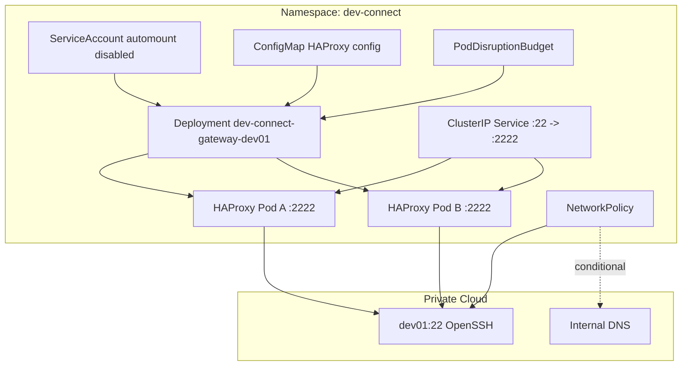
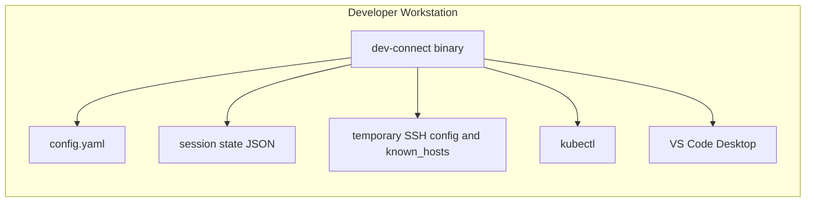
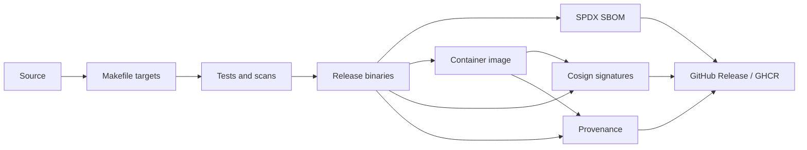

# dev-connect Deployment Diagrams

Status: Approved

## Kubernetes Deployment

```mermaid
flowchart TB
    subgraph NS["Namespace: dev-connect"]
        SA["ServiceAccount automount disabled"]
        DEP["Deployment dev-connect-gateway-dev01"]
        POD1["HAProxy Pod A :2222"]
        POD2["HAProxy Pod B :2222"]
        SVC["ClusterIP Service :22 -> :2222"]
        CM["ConfigMap HAProxy config"]
        NP["NetworkPolicy"]
        PDB["PodDisruptionBudget"]
    end

    subgraph Private["Private Cloud"]
        DEV["dev01:22 OpenSSH"]
        DNS["Internal DNS"]
    end

    DEP --> POD1
    DEP --> POD2
    CM --> DEP
    SVC --> POD1
    SVC --> POD2
    NP --> DEV
    NP -.conditional.-> DNS
    POD1 --> DEV
    POD2 --> DEV
    PDB --> DEP
    SA --> DEP
```

## Client Deployment

```mermaid
flowchart LR
    subgraph Workstation["Developer Workstation"]
        BIN["dev-connect binary"]
        CFG["config.yaml"]
        STATE["session state JSON"]
        TEMP["temporary SSH config and known_hosts"]
        K["kubectl"]
        CODE["VS Code Desktop"]
    end

    BIN --> CFG
    BIN --> STATE
    BIN --> TEMP
    BIN --> K
    BIN --> CODE
```

## CI/CD Deployment Flow

```mermaid
flowchart LR
    SRC["Source"]
    MAKE["Makefile targets"]
    TEST["Tests and scans"]
    BIN["Release binaries"]
    SBOM["SPDX SBOM"]
    IMG["Container image"]
    SIGN["Cosign signatures"]
    PROV["Provenance"]
    REL["GitHub Release / GHCR"]

    SRC --> MAKE
    MAKE --> TEST
    TEST --> BIN
    BIN --> SBOM
    BIN --> IMG
    IMG --> SIGN
    BIN --> SIGN
    BIN --> PROV
    IMG --> PROV
    SIGN --> REL
    SBOM --> REL
    PROV --> REL
```

