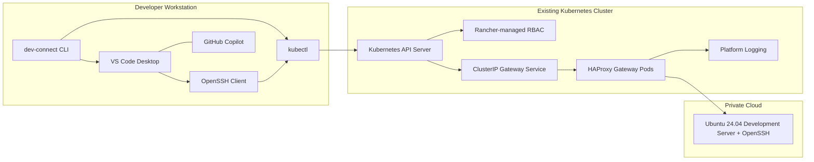

# dev-connect Architecture Guide

Status: Approved

## Overview

`dev-connect` enables developers to use Microsoft Visual Studio Code Desktop Remote SSH against Linux development servers in a private cloud.

The only permitted workstation-to-private-cloud path is through the Kubernetes API. Developers do not use VPN, bastion hosts, public IP addresses, or browser-based VS Code.

The initial architecture uses:

- a local `dev-connect` CLI,
- the locally installed `kubectl` binary,
- `kubectl port-forward`,
- a Kubernetes `ClusterIP` Service,
- HAProxy as a TCP-only gateway,
- OpenSSH on the target Ubuntu 24.04 development server.

## Architecture Principles

- The gateway forwards TCP only.
- SSH authentication remains on the Linux development server.
- No SSH credentials, private keys, passwords, Kubernetes tokens, or user databases are stored in Kubernetes.
- The client never connects directly to Rancher or the Kubernetes API.
- Kubernetes communication is delegated to the local `kubectl` binary.
- Kubernetes authentication and authorization follow the existing Rancher authentication model.
- SSH host key pinning is mandatory.
- Logs contain metadata only, never SSH payloads.

## Component Model

## First-Release Routing Model

The first release uses one gateway Deployment per backend development server.

Each gateway Deployment:

- runs HAProxy,
- listens internally on TCP port `2222`,
- is exposed through a Kubernetes Service on TCP port `22`,
- forwards traffic to exactly one backend target on TCP port `22`.

Multi-target routing is deferred to a future operator or dynamic gateway generation model.

## Communication Flow

1. Developer runs `dev-connect connect dev01`.
2. `dev-connect` loads YAML configuration.
3. `dev-connect` invokes local `kubectl` for connectivity checks.
4. `dev-connect` validates RBAC using `kubectl auth can-i`.
5. `dev-connect` validates port-forward behavior with a temporary `kubectl port-forward`.
6. `dev-connect` allocates a loopback local TCP port.
7. `dev-connect` starts the managed `kubectl port-forward`.
8. `dev-connect` writes temporary SSH config and temporary `known_hosts`.
9. `dev-connect` launches VS Code Desktop Remote SSH.
10. VS Code connects through OpenSSH to `127.0.0.1:<localPort>`.
11. SSH traffic traverses the Kubernetes API to the gateway Service.
12. HAProxy forwards TCP to the target development server.

## Security Boundary

Kubernetes provides authenticated transport and authorization for port-forward access. It does not authenticate SSH users.

The development server remains the authority for:

- SSH authentication,
- user account authorization,
- filesystem permissions,
- shell policy,
- sudo policy,
- target host audit logs.

## Scalability Model

The initial production design target is 100 simultaneous developers. The architecture shall support a growth target of 250 simultaneous developers without redesign.

Capacity assumptions:

- one active `kubectl port-forward` per developer,
- 0.5 Mbit/s average throughput per developer,
- 25 Mbit/s peak throughput per developer,
- horizontal scaling through additional gateway Pods and target-specific gateway Deployments.

## Future Extensions

The architecture leaves room for:

- CRD/operator managed gateway inventory,
- dynamic gateway generation,
- service discovery,
- multi-cluster support,
- multiple private clouds,
- Entra ID and OIDC integration through existing platform identity,
- session recording,
- audit enrichment,
- developer workspace scheduling.

