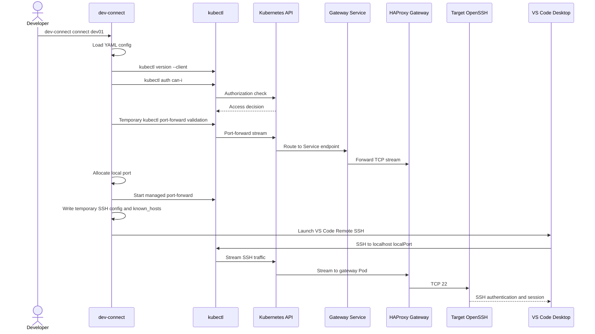
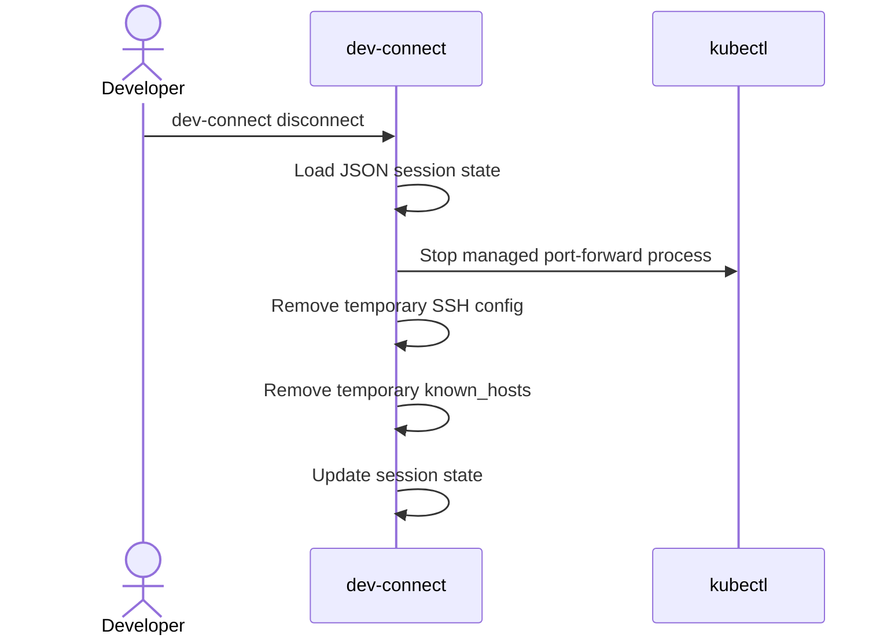
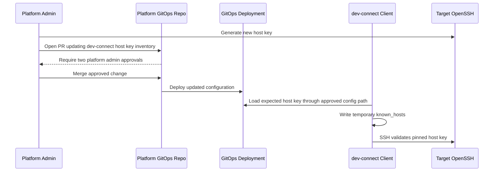

# dev-connect Sequence Diagrams

Status: Draft for Phase 10 review

## Connect

```mermaid
sequenceDiagram
    actor Developer
    participant CLI as dev-connect
    participant K as kubectl
    participant API as Kubernetes API
    participant SVC as Gateway Service
    participant GW as HAProxy Gateway
    participant SSHD as Target OpenSSH
    participant Code as VS Code Desktop

    Developer->>CLI: dev-connect connect dev01
    CLI->>CLI: Load YAML config
    CLI->>K: kubectl version --client
    CLI->>K: kubectl auth can-i
    K->>API: Authorization check
    API-->>K: Access decision
    CLI->>K: Temporary kubectl port-forward validation
    K->>API: Port-forward stream
    API->>SVC: Route to Service endpoint
    SVC->>GW: Forward TCP stream
    CLI->>CLI: Allocate local port
    CLI->>K: Start managed port-forward
    CLI->>CLI: Write temporary SSH config and known_hosts
    CLI->>Code: Launch VS Code Remote SSH
    Code->>K: SSH to localhost localPort
    K->>API: Stream SSH traffic
    API->>GW: Stream to gateway Pod
    GW->>SSHD: TCP 22
    SSHD-->>Code: SSH authentication and session
```

## Disconnect

```mermaid
sequenceDiagram
    actor Developer
    participant CLI as dev-connect
    participant K as kubectl

    Developer->>CLI: dev-connect disconnect
    CLI->>CLI: Load JSON session state
    CLI->>K: Stop managed port-forward process
    CLI->>CLI: Remove temporary SSH config
    CLI->>CLI: Remove temporary known_hosts
    CLI->>CLI: Update session state
```

## Host Key Rotation

```mermaid
sequenceDiagram
    participant Admin as Platform Admin
    participant Git as Platform GitOps Repo
    participant Cluster as GitOps Deployment
    participant CLI as dev-connect Client
    participant SSHD as Target OpenSSH

    Admin->>SSHD: Generate new host key
    Admin->>Git: Open PR updating dev-connect host key inventory
    Git-->>Admin: Require two platform admin approvals
    Admin->>Git: Merge approved change
    Git->>Cluster: Deploy updated configuration
    CLI->>Cluster: Load expected host key through approved config path
    CLI->>CLI: Write temporary known_hosts
    CLI->>SSHD: SSH validates pinned host key
```

