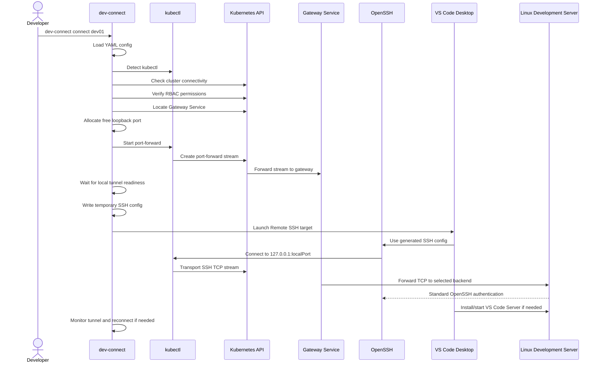

# dev-connect Functional Specification

Status: Approved

## 1. Purpose

This document defines the required functional behavior of `dev-connect`.

`dev-connect` enables developers to open Microsoft Visual Studio Code Desktop Remote SSH sessions to Linux development servers in a private cloud. The only permitted network path from the developer workstation to the private cloud is through the Kubernetes API and a Kubernetes-hosted TCP gateway.

This specification is implementation-neutral except where Phase 1 architecture decisions require a concrete behavior.

## 2. Phase 1 Decisions Applied

The functional behavior shall follow these Phase 1 decisions:

- The gateway exposes one Kubernetes Service listener for client port-forward traffic.
- Phase 4 implements one HAProxy TCP listener on port 22 with one backend target per gateway Deployment.
- Multi-target routing is deferred to a later phase using either separate gateway Deployments per target or dynamic gateway generation.
- The long-term server inventory source is a future Kubernetes CRD/operator control plane.
- First implementation artifacts shall remain compatible with future operator-managed inventory.
- Development servers are addressed by stable IP addresses or DNS names.
- Reconnect is automatic by default.
- The gateway never performs SSH authentication and only forwards TCP traffic.
- `dev-connect` shall never establish direct network connections to Rancher or the Kubernetes API.
- All Kubernetes communication shall be delegated to the locally installed `kubectl` binary.
- `kubectl` shall use the user's existing kubeconfig and enterprise proxy configuration by default.
- Optional user-specific proxy overrides may be applied only to `kubectl` processes started by `dev-connect`.
- Kubernetes authentication and authorization follow the existing Rancher authentication model.
- Access is granted through Rancher-managed Kubernetes RBAC and existing enterprise identity providers where configured.
- The solution introduces no separate identity store.
- SSH host key pinning is mandatory.
- Host keys are centrally managed as infrastructure configuration through the existing GitOps process.
- Logging and auditing record metadata only, never SSH contents.
- Log retention is enforced by the centralized enterprise logging backend, not by `dev-connect`.
- Development placeholder values are 30 days for `dev-connect` metadata logs and 90 days for Kubernetes audit logs; these values are configurable and are not architectural constraints.
- The default operating model is at most one active port-forward per developer.
- The production sizing target is 100 simultaneous developers, with a growth target of 250 without architectural redesign.
- Performance testing uses 0.5 Mbit/s average and 25 Mbit/s peak throughput per developer.
- Session timeout defaults are 60 minutes idle timeout and 12 hours maximum session duration.

## 3. Actors

Developer:

- Runs `dev-connect` on Windows, Linux, or macOS.
- Has VS Code Desktop installed.
- Has OpenSSH client support available.
- Has access to an existing Kubernetes kubeconfig.
- Authenticates to Kubernetes through the existing Rancher authentication model.
- Is authorized through Rancher-managed Kubernetes RBAC, typically via an enterprise group such as `dev-connect-users`.
- Has SSH authorization on the target Linux development server.

Platform Operator:

- Installs and operates the Kubernetes gateway.
- Defines gateway inventory and routing.
- Grants least-privilege Kubernetes access to developers.
- Monitors gateway health and audit logs.

Security Operator:

- Reviews access model, audit trails, NetworkPolicies, RBAC, and SSH ownership boundaries.

## 4. Functional Scope

In scope:

- CLI commands: `connect`, `disconnect`, `status`, and `list`.
- Kubernetes connectivity and RBAC preflight checks.
- Gateway discovery.
- Local TCP port allocation.
- `kubectl port-forward` process management.
- Temporary SSH configuration generation.
- Optional managed user OpenSSH config block creation and removal.
- VS Code Desktop launch for Remote SSH.
- Session state management.
- Tunnel monitoring.
- Automatic reconnect.
- Cleanup after disconnect or failed startup.
- YAML configuration.
- Multi-context, multi-cluster, and multi-gateway configuration model.

Out of scope for first implementation:

- Browser-based IDEs.
- SSH authentication in the gateway.
- Storing credentials or SSH keys in Kubernetes.
- Dynamic operator implementation.
- Session recording.
- Development server provisioning.
- User lifecycle management on development servers.

## 5. Terminology

Gateway:

- Kubernetes-hosted TCP forwarding component, initially HAProxy.

Gateway Service:

- Kubernetes `ClusterIP` Service selected by `kubectl port-forward`.

Target:

- Logical development server alias, such as `dev01`.

Session:

- Locally tracked connection attempt and active tunnel for one selected target.

Tunnel:

- Local TCP listener created by `kubectl port-forward` and connected through the Kubernetes API to the Gateway Service.

Temporary SSH config:

- File generated by `dev-connect` for the duration of a session and passed to OpenSSH/VS Code.

## 6. Command Line Interface

### 6.1 Command Summary

The CLI shall support:

```text
dev-connect connect <target>
dev-connect disconnect
dev-connect status
dev-connect list
dev-connect version
dev-connect help
```

The CLI should support global flags:

```text
--config <path>
--context <name>
--cluster <name>
--gateway <name>
--log-level <error|warn|info|debug>
--log-format <text|json>
--output <text|json>
--no-code
--no-reconnect
--timeout <duration>
```

### 6.2 `connect`

Command:

```text
dev-connect connect dev01
```

Functional requirements:

- `connect` shall validate that `<target>` is provided.
- `connect` shall load configuration before any external process is started.
- `connect` shall resolve the selected context, cluster, gateway, and target.
- `connect` shall verify `kubectl` availability.
- `connect` shall verify Kubernetes API connectivity.
- `connect` shall verify required Kubernetes permissions.
- `connect` shall discover the Gateway Service.
- `connect` shall allocate a free local TCP port on loopback.
- `connect` shall start `kubectl port-forward`.
- `connect` shall wait until the tunnel is established before launching VS Code.
- `connect` shall generate temporary SSH configuration.
- `connect` shall launch VS Code Desktop Remote SSH unless `--no-code` is set.
- `connect` shall persist local session state.
- `connect` shall monitor tunnel health.
- `connect` shall automatically reconnect by default when the tunnel fails for a transient reason.
- `connect` shall not retry SSH credentials or modify SSH authentication behavior.
- `connect` shall clean up temporary resources if startup fails.

Expected high-level workflow:



### 6.3 `disconnect`

Command:

```text
dev-connect disconnect
```

Functional requirements:

- `disconnect` shall read local session state.
- `disconnect` shall stop the managed `kubectl port-forward` process if it exists.
- `disconnect` shall remove temporary SSH configuration created by `dev-connect`.
- `disconnect` shall remove local lock files and session metadata.
- `disconnect` shall be idempotent.
- `disconnect` shall not delete user-managed SSH configuration.
- `disconnect` shall report if no active managed session exists.

### 6.4 `status`

Command:

```text
dev-connect status
```

Functional requirements:

- `status` shall report whether a managed session is active.
- `status` shall report target alias, local port, Kubernetes context, namespace, gateway, reconnect policy, and uptime when available.
- `status` shall detect stale session state.
- `status` shall not start a new tunnel.
- `status` shall support text output by default.
- `status` shall support machine-readable JSON command responses through `--output json`.
- `--output json` shall be independent from internal log format.

Possible statuses:

- `disconnected`: no managed session.
- `connecting`: session startup is in progress.
- `connected`: tunnel process is active and local readiness check succeeds.
- `degraded`: session state exists but a check failed.
- `reconnecting`: reconnect loop is active.
- `stale`: state exists but no managed process is active.

### 6.5 `list`

Command:

```text
dev-connect list
```

Functional requirements:

- `list` shall show configured clusters, gateways, and targets visible to the selected configuration scope.
- `list` shall indicate the default context and gateway.
- `list` shall not reveal credentials.
- `list` should optionally verify Kubernetes-side gateway availability.
- `list` shall support target aliases backed by stable IP or DNS names.

### 6.6 `version`

Functional requirements:

- `version` shall print CLI version, commit, build date, Go runtime, operating system, and architecture when available.

## 7. Configuration

### 7.1 Configuration Locations

The CLI shall load configuration in this precedence order:

1. `--config <path>`
2. `DEV_CONNECT_CONFIG`
3. OS-specific user config path
4. repository or working-directory config path for test/dev use

Default user config paths:

- Windows: `%APPDATA%\dev-connect\config.yaml`
- macOS: `~/Library/Application Support/dev-connect/config.yaml`
- Linux: `~/.config/dev-connect/config.yaml`

### 7.2 Configuration Model

The configuration shall be YAML.

Illustrative schema:

```yaml
apiVersion: dev-connect/v1
kind: DevConnectConfig
currentContext: default
contexts:
  default:
    cluster: private-cloud-dev
    gateway: primary
    kubernetesContext: platform-dev
clusters:
  private-cloud-dev:
    kubeconfig: ""
    kubernetesContext: platform-dev
    proxy:
      enabled: false
      httpProxy: ""
      httpsProxy: ""
      noProxy: ""
gateways:
  primary:
    namespace: dev-connect
    serviceName: dev-connect-gateway
    servicePort: 2222
    routingMode: tcp-explicit
    reconnect:
      enabled: true
      maxAttempts: 5
      initialBackoff: 1s
      maxBackoff: 30s
    session:
      idleTimeout: 60m
      maxDuration: 12h
    logging:
      retentionManagedBy: enterprise-logging-platform
      metadataRetentionPlaceholder: 30d
      kubernetesAuditRetentionPlaceholder: 90d
targets:
  dev01:
    gateway: primary
    routeName: dev01
    user: ""
    hostKeyAlias: dev01
    hostKeyRef: dev01-ed25519
hostKeys:
  dev01-ed25519:
    host: dev01
    algorithm: ssh-ed25519
    publicKey: "<centrally-managed-host-public-key>"
```

Notes:

- The client config may reference targets and route names, but future CRD/operator inventory is the intended source of truth for backend addresses.
- Client YAML shall not store SSH private keys, Kubernetes tokens, passwords, or development server credentials.
- Host key entries are public host keys, not credentials, and shall be sourced from the existing GitOps-managed infrastructure configuration.
- Proxy settings are optional user-specific overrides. When configured, they apply only to `kubectl` processes started by `dev-connect` and shall not modify operating system, corporate, shell, or kubeconfig proxy settings.
- `user` may be empty, allowing OpenSSH defaults or user SSH config behavior.
- `routeName` is the logical route selected by the gateway routing strategy.

### 7.3 Configuration Validation

The CLI shall validate:

- YAML syntax.
- Supported `apiVersion` and `kind`.
- Existing selected context.
- Existing referenced cluster and gateway.
- Gateway namespace, service name, and service port format.
- Target alias format.
- Reconnect settings.

The CLI shall fail before starting `kubectl` when configuration is invalid.

## 8. Kubernetes Preflight

### 8.1 `kubectl` Detection

The CLI shall:

- Search `PATH` for `kubectl`.
- Allow explicit override through configuration or environment variable.
- Execute `kubectl version` to validate Kubernetes API reachability.
- Fail with an actionable message when `kubectl` is missing.
- Treat `kubectl` as the only mechanism for Kubernetes and Rancher-backed cluster communication.
- Never create a direct Kubernetes API or Rancher API client connection.

### 8.2 Connectivity Check

The CLI shall:

- Use the selected kubeconfig and Kubernetes context.
- Verify the Kubernetes API server is reachable.
- Verify the configured namespace exists or report that it cannot be accessed.
- Perform connectivity checks by invoking `kubectl`, not by opening a direct network connection from `dev-connect`.
- Use the user's existing kubeconfig and enterprise proxy configuration by default.
- Apply optional proxy overrides only to the `kubectl` process environment for the command being executed.
- Avoid writing proxy overrides into the user's operating system configuration, corporate proxy configuration, kubeconfig, shell profile, or persistent environment.

### 8.3 Authorization Check

The CLI shall verify least-privilege permissions before starting a tunnel.

Required permissions:

- Read gateway discovery resources in the gateway namespace.
- `create` on `pods/portforward` in the gateway namespace.

Required identity model:

- Kubernetes authentication and authorization shall follow the existing Rancher authentication model.
- The solution shall not introduce a separate identity store.
- Access permissions shall be granted through Rancher-managed Kubernetes RBAC and existing enterprise identity providers where configured.
- RBAC shall be assigned through groups, not local Kubernetes users.
- Expected groups are `dev-connect-users`, `dev-connect-admins`, and `platform-admins`.

The CLI should use `SelfSubjectAccessReview` where available. If the cluster does not allow explicit preflight checks, the CLI shall attempt the minimal discovery and port-forward operations and report authorization failures clearly.

The CLI shall not require:

- reading Secrets,
- creating Pods,
- executing into Pods,
- updating ConfigMaps,
- accessing unrelated namespaces.

## 9. Gateway Discovery

Functional requirements:

- The CLI shall locate the Gateway Service by configured namespace and service name.
- The CLI shall verify the configured Service port exists.
- The CLI shall verify at least one ready endpoint is available when endpoint discovery is permitted.
- The CLI shall fail before launching VS Code if no gateway endpoint is ready.
- The CLI shall support multiple configured gateways across multiple clusters.

## 10. Local Port Allocation

Functional requirements:

- The CLI shall bind only to loopback addresses.
- The CLI shall allocate a free local TCP port automatically.
- The CLI shall avoid privileged ports.
- The CLI shall detect port collisions between allocation and port-forward startup.
- The CLI shall retry bounded allocation attempts before failing.
- The selected local port shall be recorded in session state.

Default loopback binding:

- `127.0.0.1` for IPv4.
- Future support may include `::1` when platform behavior is verified.

## 11. Port-Forward Management

Functional requirements:

- The CLI shall start `kubectl port-forward service/<gateway-service> <localPort>:<servicePort>`.
- The CLI shall pass the selected namespace and Kubernetes context explicitly.
- The CLI shall pass any optional user-specific proxy override only to the managed `kubectl port-forward` process environment.
- The CLI shall capture stdout and stderr for readiness and diagnostics.
- The CLI shall wait for a positive readiness signal before proceeding.
- The CLI shall enforce startup timeout.
- The CLI shall terminate the process during cleanup.
- The CLI shall not leave orphaned managed `kubectl` processes when startup fails.

Readiness conditions:

- `kubectl` reports forwarding on the selected local port, and
- a local TCP connection to the local port can be opened, or
- equivalent platform-specific readiness check succeeds.

## 12. TCP Routing Selection

The first-release gateway uses one HAProxy TCP listener on port 22 with one backend target per gateway Deployment.

Functional requirements:

- The CLI shall select a logical gateway route for the target.
- The generated SSH configuration shall include the information required for the gateway to route the TCP connection to the selected target.
- Routing shall not require the gateway to authenticate the SSH user.
- Routing shall not expose SSH credentials to the gateway.
- Routing shall connect to the selected gateway Deployment that represents one backend development server target.
- Multi-target routing shall be deferred to a later phase using separate gateway Deployments per target or dynamic gateway generation.

Design constraint:

- Phase 4 shall implement a TCP-only HAProxy listener on port 22. It shall not use SSH metadata inspection, SSH termination, credential-bearing routing, or `StrictHostKeyChecking=no`.

## 13. Temporary SSH Configuration

Functional requirements:

- The CLI shall generate a temporary SSH config file for the session.
- The generated config shall point the selected target alias to `127.0.0.1:<localPort>`.
- The generated config shall preserve standard OpenSSH authentication behavior.
- The generated config shall not contain private keys, passwords, Kubernetes tokens, or secrets.
- The generated config shall be readable only by the current user where the operating system supports file permissions.
- The generated config shall be removed during cleanup.
- The CLI shall avoid modifying the user's persistent SSH config by default.

Illustrative generated config:

```sshconfig
Host dev01.dev-connect
  HostName 127.0.0.1
  Port 49152
  User developer
  HostKeyAlias dev01
  StrictHostKeyChecking yes
  UserKnownHostsFile /path/to/dev-connect/known_hosts
```

Host key policy:

- SSH host key pinning is mandatory.
- The generated SSH configuration shall use pinned host keys from a dev-connect-managed known hosts file or an approved enterprise host key source.
- `StrictHostKeyChecking=no` is forbidden.
- `accept-new` shall not be the default because it permits first-use trust without prior pinning.
- Host keys shall be centrally managed.
- The client shall load the expected target host key during connection startup.
- The client shall write the expected host key to a temporary `known_hosts` file for the generated SSH configuration.
- Host key rotation shall follow a controlled GitOps flow: host key generation, GitOps change, deployment, and client use of the new key.
- Pinned SSH host keys shall be owned by the existing Platform GitOps repository under a dedicated `dev-connect` directory.
- Changes to host keys shall require the standard platform pull request approval workflow before deployment.

## 14. VS Code Launch

Functional requirements:

- The CLI shall detect the VS Code Desktop command-line launcher where possible.
- The CLI shall support configured launcher path.
- The CLI shall first resolve the VS Code launcher from `PATH`.
- If the launcher is not found in `PATH`, the CLI shall check documented OS-specific default installation paths.
- The CLI shall launch VS Code Remote SSH for the generated host alias.
- The CLI shall allow `--no-code` for tunnel-only operation.
- The CLI shall use a session-scoped VS Code user-data directory by default.
- The CLI shall support `vscode.isolatedUserDataDir: false` for normal local VS Code profile mode when the target alias is resolvable there.
- The CLI shall support `ssh.manageUserConfig: true` to write a marked dev-connect block to the user's OpenSSH config during `connect`.
- The CLI shall remove only the marked dev-connect OpenSSH config block during `disconnect`.
- The CLI shall fail clearly when VS Code cannot be launched.
- The CLI shall not install or manage VS Code extensions.
- The CLI shall not run browser-based VS Code.
- GitHub Copilot shall continue to run locally as part of the user's local VS Code Desktop environment.

Expected launch target format:

```text
code --remote ssh-remote+dev01.dev-connect
```

The exact command may vary by platform and shall be covered by implementation tests.

## 15. VS Code Server Behavior

Functional requirements:

- VS Code Server installation shall be performed by VS Code Remote SSH through the established SSH session.
- `dev-connect` shall not copy, install, or update VS Code Server directly.
- The remote Linux server shall enforce filesystem and user permissions for VS Code Server installation.
- Failures from VS Code Server installation shall be surfaced as VS Code/OpenSSH failures, not gateway authentication failures.

## 16. Session State

Functional requirements:

- The CLI shall maintain local session state for managed sessions.
- Session state shall include target alias, generated host alias, local port, kube context, namespace, service name, service port, process ID, reconnect policy, timestamps, and temporary file paths.
- Session state shall not include credentials.
- State files shall be scoped to the current OS user.
- The CLI shall detect and clean stale state safely.
- Concurrent sessions shall be controlled by an explicit locking strategy.

Default first-release behavior:

- One active managed session per user profile.
- One active port-forward per developer by default.
- Future versions may support multiple named concurrent sessions.

## 17. Reconnect Behavior

Reconnect is enabled by default.

Functional requirements:

- The CLI shall monitor the managed port-forward process.
- The CLI shall detect unexpected process exit.
- The CLI shall apply bounded exponential backoff.
- The CLI shall preserve the same target and session metadata during reconnect.
- The CLI should attempt to reuse the same local port when safe.
- The CLI shall stop reconnecting after the configured maximum attempts.
- The CLI shall not retry SSH passwords or authentication prompts.
- The CLI shall not hide authorization failures as transient errors.
- The CLI shall log reconnect attempts and outcomes.
- `--no-reconnect` shall disable automatic reconnect for the current command.

Default reconnect policy:

```yaml
enabled: true
maxAttempts: 5
initialBackoff: 1s
maxBackoff: 30s
```

## 18. Session Timeout Behavior

Functional requirements:

- Session timeouts shall be configurable.
- The idle timeout shall default to 60 minutes.
- The maximum session duration shall default to 12 hours.
- The CLI shall perform graceful cleanup of temporary resources when a managed session ends because of timeout.
- Automatic reconnect shall remain enabled for short `kubectl port-forward` interruptions unless the maximum session duration has been reached.
- Timeout enforcement shall not terminate unrelated user processes.

## 19. Cleanup

Functional requirements:

- Cleanup shall run after explicit disconnect.
- Cleanup shall run after failed startup.
- Cleanup shall remove temporary SSH config files.
- Cleanup shall stop the managed port-forward process.
- Cleanup shall release locks and session state.
- Cleanup shall be idempotent.
- Cleanup shall not delete user-managed SSH files.
- Cleanup shall not kill unrelated `kubectl` processes.

## 20. Logging and User Output

Functional requirements:

- The CLI shall provide human-readable command output by default.
- The CLI shall support structured logs for automation.
- Logs shall include metadata only: session ID, user identity where available, target server, gateway, namespace, Kubernetes context, local port number, start time, end time, duration, exit code, and high-level lifecycle events.
- Logs shall redact credentials, tokens, passwords, private key material, SSH payloads, terminal contents, and transferred file contents.
- `dev-connect` shall not enforce log retention itself.
- Log retention shall be enforced by the centralized enterprise logging backend according to enterprise retention policies.
- The target platform logging backend for the first deployment shall be Azure Monitor / Log Analytics.
- Retention and forwarding to SIEM shall be handled by the logging backend, not by `dev-connect`.
- Development placeholder values are 30 days for metadata logs and 90 days for Kubernetes audit logs; these values shall be configurable and shall not be treated as architectural constraints.
- Debug logs may include sanitized external command invocations.
- User-facing errors shall include next-step guidance where practical.

## 21. Error Handling

Required error categories:

- Configuration error.
- Missing dependency.
- Kubernetes connectivity error.
- Kubernetes authorization error.
- Gateway discovery error.
- Gateway unavailable.
- Local port allocation error.
- Port-forward startup error.
- Tunnel readiness timeout.
- VS Code launch error.
- SSH connection/authentication error.
- Cleanup error.
- Reconnect exhausted.

Errors shall be distinguishable in logs and should map to stable exit codes.

## 22. Exit Codes

Suggested exit code model:

| Code | Meaning |
| --- | --- |
| 0 | Success |
| 1 | General error |
| 2 | Invalid command or arguments |
| 3 | Configuration error |
| 4 | Missing dependency |
| 5 | Kubernetes connectivity error |
| 6 | Kubernetes authorization error |
| 7 | Gateway unavailable |
| 8 | Local port or port-forward failure |
| 9 | VS Code launch failure |
| 10 | Managed session not found |
| 11 | Reconnect exhausted |

## 23. Security Functional Requirements

- The CLI shall never write SSH private keys.
- The CLI shall never write Kubernetes tokens.
- The CLI shall never ask the gateway to authenticate SSH users.
- The CLI shall never require Kubernetes Secrets read access.
- The gateway shall only forward TCP traffic.
- SSH authentication shall always occur on the remote Linux server.
- Temporary files shall use restrictive permissions.
- Local listeners shall bind to loopback only.
- User-visible output and logs shall redact sensitive material.
- Kubernetes access shall be limited to the gateway namespace.
- Kubernetes authentication and authorization shall follow the existing Rancher authentication model.
- RBAC shall be assigned through Rancher-managed Kubernetes RBAC and enterprise groups where configured.
- The solution shall not introduce a separate identity store.
- SSH host key pinning shall be enforced.
- `StrictHostKeyChecking=no` shall not be generated or recommended.
- The client shall use centrally managed pinned host keys from the existing GitOps-managed infrastructure configuration.

## 24. Compatibility Requirements

Operating systems:

- Windows.
- Linux.
- macOS.

External dependencies:

- `kubectl`.
- VS Code Desktop command-line launcher.
- OpenSSH client behavior compatible with VS Code Remote SSH.

Kubernetes:

- Kubernetes v1.30+ target platform.

Development servers:

- Ubuntu 24.04 LTS.
- Standard OpenSSH server.

## 25. Performance Test Assumptions

Performance tests shall model typical Remote SSH development activity rather than only synthetic sustained bandwidth.

| Activity | Average | Peak |
| --- | --- | --- |
| Terminal | < 50 kbit/s | 200 kbit/s |
| VS Code editing | 100-300 kbit/s | 1 Mbit/s |
| Git pull/push | Few Mbit/s | 20-50 Mbit/s |
| Debugging | < 1 Mbit/s | 5 Mbit/s |
| File synchronization | Few Mbit/s | 20-100 Mbit/s |

Baseline load tests shall use 0.5 Mbit/s average throughput per developer and 25 Mbit/s peak throughput per developer.

## 26. Functional Acceptance Criteria

### 26.1 Successful Connect

Given a valid config, valid Kubernetes access, reachable gateway, and an SSH-authorized user, when the developer runs:

```text
dev-connect connect dev01
```

Then:

- Kubernetes preflight succeeds.
- a local loopback port is allocated.
- `kubectl port-forward` starts.
- temporary SSH config is generated.
- VS Code Desktop launches Remote SSH.
- SSH authentication occurs on `dev01`.
- VS Code Server installation is handled by VS Code.
- session state is recorded.

### 26.2 Missing Kubernetes Permission

Given the developer lacks `create` on `pods/portforward`, when `connect` is executed, then:

- no VS Code process is launched by `dev-connect`.
- no temporary SSH config remains after failure.
- the error identifies the missing Kubernetes permission.

### 26.3 Gateway Unavailable

Given the Gateway Service has no ready endpoint, when `connect` is executed, then:

- the command fails before VS Code launch.
- no stale managed tunnel remains.
- the error identifies the gateway namespace and service.

### 26.4 SSH Authentication Failure

Given Kubernetes and gateway connectivity succeed but OpenSSH authentication fails on the development server, then:

- the gateway does not handle credentials.
- the CLI does not retry credentials.
- the user sees an SSH/VS Code authentication failure.
- cleanup remains available through `disconnect`.

### 26.5 Automatic Reconnect

Given an active session and a transient port-forward process exit, then:

- the CLI detects the exit.
- reconnect attempts start with bounded backoff.
- reconnect attempts are logged.
- reconnect stops after the configured maximum attempts.

### 26.6 Disconnect

Given an active managed session, when the developer runs:

```text
dev-connect disconnect
```

Then:

- the managed port-forward process stops.
- temporary SSH config is deleted.
- session state is removed.
- unrelated processes and user SSH config are not modified.

## 27. Traceability to Future Tests

The implementation phase shall map tests to these functional areas:

- Configuration parsing and validation.
- Command argument validation.
- `kubectl` detection.
- Kubernetes preflight success and failure.
- RBAC denied behavior.
- Gateway discovery.
- Local port allocation.
- Port-forward startup and readiness.
- SSH config generation and permissions.
- VS Code launch command construction.
- Session state and stale cleanup.
- Reconnect behavior.
- Session timeout behavior.
- Host key pinning and rotation behavior.
- Performance throughput assumptions.
- Error codes.
- Logging redaction.
- Logging backend integration metadata.
- Cross-platform path handling.
- Concurrent command locking.

## 28. Phase Gate

This document completes the approved Phase 2 functional specification. Phase 3 may start.
